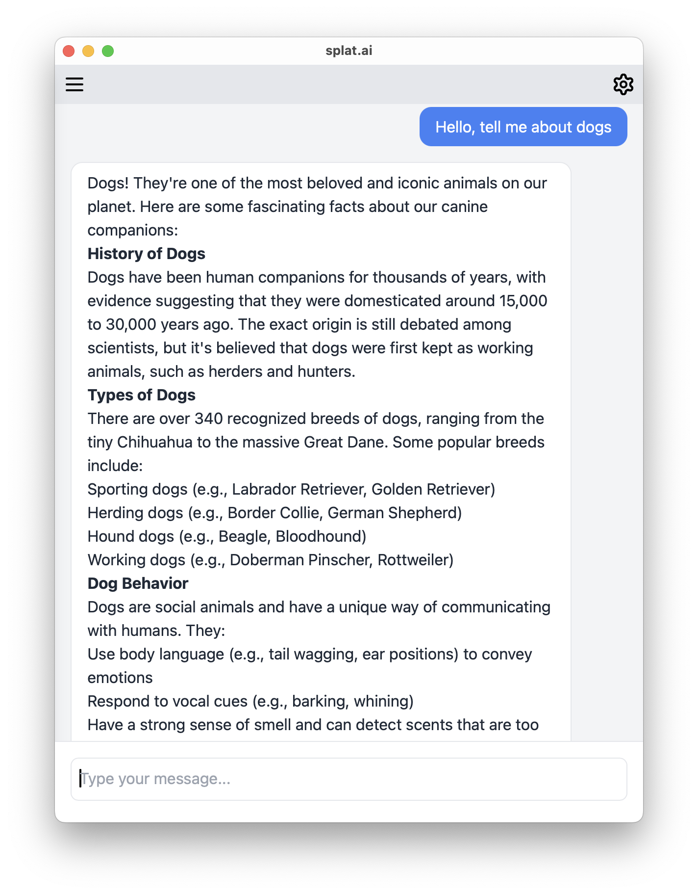

<p align="center">

</p>

splat.ai is a MacOS app that allows you to chat with your favorite AI models using [Ollama](https://ollama.ai/).

- 💁‍♂️ Intuitive: A simple chat interface with the ability to have multiple conversations.
- 🔒 Secure: Everything runs 100% locally on your machine, no data leaves your computer.
- 🔃 Customizable: Configure your own API URL and models.

<p align="center">

</p>

## Getting Started

1. Install Ollama

Download and Install [Ollama](https://ollama.ai/). Make sure is running before proceeding.

2. Pull a model to use

You can use [any model](https://ollama.ai/models) supported by Ollama. To use a model, click the "Settings" button, type in the name of the model you want to use and click "Pull".

3. Download the app and enable running it

Download the latest release of the app from the [releases page](https://github.com/andrewsouthard/splat.ai/releases/latest).

Enable running the app (due to signing requirements) by running the following command in the terminal:

```bash
xattr -dr com.apple.quarantine <path_to_app>
```

Replace `<path_to_app>` with the path to the downloaded app.

4. Install the app and start chatting!

## Development

1. Install Rust and Node.js

We suggest using [rustup](https://rustup.rs/) to install Rust and [nvm](https://github.com/nvm-sh/nvm) to install Node.js.

2. Install dependencies

```bash
npm install
```

3. Run the app

```
npx tauri dev
```

## Releasing

Releases are done through Github Actions. To prepare for a release, first bump the version using `tauri-version`. To bump the patch version, run:

```bash
npx tauri-version@latest patch
```
