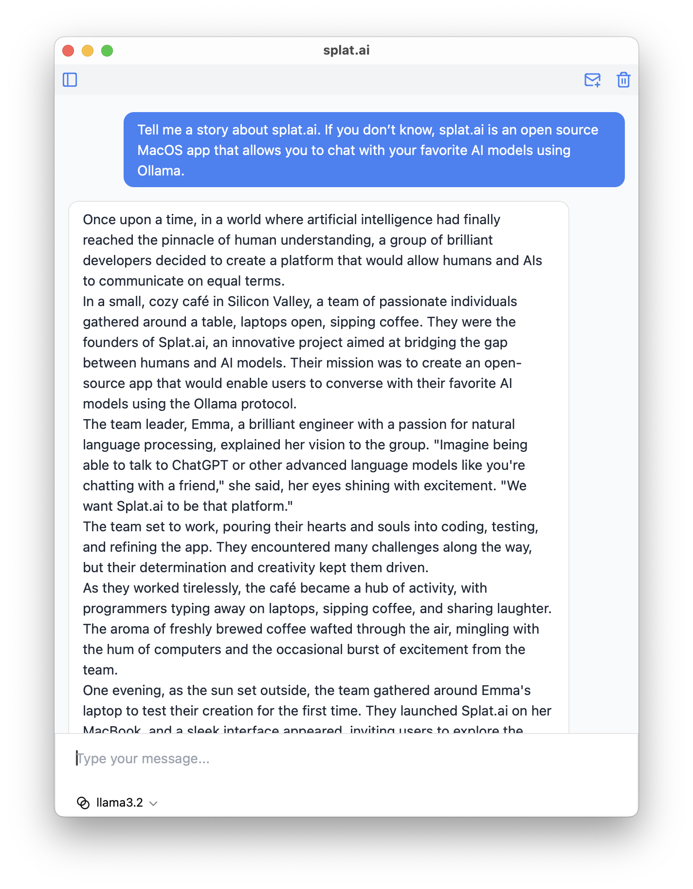

# splat.ai

splat.ai is a MacOS app that allows you to chat with your favorite AI models using [Ollama](https://ollama.ai/).

- 💁‍♂️ Intuitive: A simple chat interface with the ability to have multiple conversations.
- 🔒 Secure: Everything runs 100% locally on your machine, no data leaves your computer.
- 🔃 Customizable: Configure your own API URL and models.

{: style="max-height: 300px;" }

---

## Getting Started

1. Install Ollama

Download and Install [Ollama](https://ollama.ai/). Make sure is running before proceeding.

2. Pull a model to use

You can use [any model](https://ollama.ai/models) supported by Ollama. To use a model, run the following command in the terminal:

```bash
ollama pull <model_name>
```

For example, to pull the `llama3.2` model, run the following command:

```bash
ollama pull llama3.2
```

3. Run the app and start chatting!

## Development

1. Install Rust and Node.js

We suggest using [rustup](https://rustup.rs/) to install Rust and [nvm](https://github.com/nvm-sh/nvm) to install Node.js.

2. Install yarn

```bash
npm install --global yarn
```

3. Install dependencies

```bash
yarn install
```

4. Run the app

```
yarn run tauri dev
```
